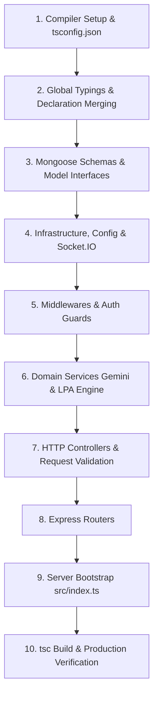

# 🚀 The Master TypeScript Migration Handbook: Prep-AI Backend
### Production-Grade Architecture, Lean Core Fast-Track, and Full Enterprise Execution

> **Unified Edition:** Merged from the foundational Core MVP Migration and the Full Enterprise Architecture. This single master guide provides the complete **What, Why, and How**, architectural theory, dual migration tracks (Lean Core vs Full Enterprise), and production-tested TypeScript source code for every file in the project.

---

## 📑 Table of Contents
1. [Core Concepts: What, Why & How of TypeScript in Node.js](#1-core-concepts-what-why--how-of-typescript-in-nodejs)
2. [Dual Migration Matrix: Choose Your Track](#2-dual-migration-matrix-choose-your-track)
   - [Track A: Lean Core Fast-Track (Roadmap + Task + AI GPS Engine in 15 min)](#track-a-lean-core-fast-track-roadmap--task--ai-gps-engine)
   - [Track B: Full Production Enterprise Suite (Auth + Sockets + Gamified LPA + Cloudinary)](#track-b-full-production-enterprise-suite)
3. [Target Directory & File Architecture](#3-target-directory--file-architecture)
4. [Step 1: Dependencies & Type Definitions Installation](#step-1-dependencies--type-definitions-installation)
5. [Step 2: `tsconfig.json` — The ESM NodeNext Standard](#step-2-tsconfigjson--the-esm-nodenext-standard)
6. [Step 3: `package.json` Build & Dev Lifecycle Scripts](#step-3-packagejson-build--dev-lifecycle-scripts)
7. [Step 4: Global Types & Express Declaration Merging (`src/types/`)](#step-4-global-types--express-declaration-merging-srctypes)
   - `src/types/express.d.ts` (Request decoration)
   - `src/types/index.ts` (Domain unions, DTOs, Socket event contracts)
8. [Step 5: Mongoose Models Layer (`src/models/`)](#step-5-mongoose-models-layer-srcmodels)
   - `src/models/user.ts` (IUser, password sanitization, virtuals)
   - `src/models/task.ts` (ITask, TaskStatus, LPA weights)
   - `src/models/roadmap.ts` (IRoadmap, weekly hierarchy, task references)
9. [Step 6: Configuration & Socket Layer (`src/config/`)](#step-6-configuration--socket-layer-srcconfig)
   - `src/config/db.ts` (Mongoose connection & lifecycle)
   - `src/config/socket.ts` (Strongly-typed Socket.IO Server)
   - `src/config/sendMail.ts` (Nodemailer OTP delivery)
   - `src/config/cloudinary.ts` (Avatar upload utility)
10. [Step 7: Middlewares Layer (`src/middlewares/`)](#step-7-middlewares-layer-srcmiddlewares)
    - `src/middlewares/errorHandler.ts` (Express ErrorRequestHandler)
    - `src/middlewares/isAuthenticated.ts` (JWT extraction from Cookie or Bearer)
    - `src/middlewares/rateLimit.ts` (IP-based brute-force defense)
    - `src/middlewares/multer.ts` (Disk storage file parser)
11. [Step 8: Domain Services Layer (`src/services/`)](#step-8-domain-services-layer-srcservices)
    - `src/services/llmService.ts` (Google Gemini 2.0 Flash with OpenAI fallback)
    - `src/services/lpaService.ts` (LPA calculation engine with backward-compatible exports)
12. [Step 9: Controllers Layer (`src/controllers/`)](#step-9-controllers-layer-srccontrollers)
    - `src/controllers/userController.ts` (Auth, Cookies, Google, OTP reset)
    - `src/controllers/roadmapController.ts` (Option B: Request body resolution & auto-save)
    - `src/controllers/taskController.ts` (Status update & live Socket.IO LPA gamification)
13. [Step 10: Routes Layer (`src/routes/`)](#step-10-routes-layer-srcroutes)
    - `src/routes/userRoutes.ts`
    - `src/routes/roadmapRoutes.ts`
    - `src/routes/taskRoutes.ts`
14. [Step 11: Server Entry Point (`src/index.ts`)](#step-11-server-entry-point-srcindexts)
15. [Step 12: Testing, Verification & Production Run Protocol](#step-12-testing-verification--production-run-protocol)
16. [Master Troubleshooting: The Comprehensive Pitfalls & Gotchas Matrix](#16-master-troubleshooting-the-comprehensive-pitfalls--gotchas-matrix)

---

## 1. Core Concepts: What, Why & How of TypeScript in Node.js

### 📌 WHAT is TypeScript in a Backend Context?
TypeScript is a statically typed superset of JavaScript developed by Microsoft.
- **Transpilation, Not Execution:** Node.js cannot natively execute `.ts` files in production. The TypeScript compiler (`tsc`) transpiles `.ts` into standard `.js` files located in `dist/`.
- **Zero Runtime Overhead (Type Erasure):** All interfaces, types, generics, and declarations exist solely at compile-time. When compiled to JavaScript, all type annotations are stripped away. Your production code executes with the exact speed and memory footprint of vanilla JavaScript.

### 📌 WHY Migrate Prep-AI to TypeScript?
1. **Eliminating Silent Runtime Crashes:**
   In JavaScript, accessing `task.roadmapId.userId` crashes your server if `roadmapId` was not populated. TypeScript's strict null checking enforces optional chaining (`task.roadmapId?.userId`) and type narrowing at build time.
2. **Defending Against String & Enum Typos:**
   In JS, updating a task with `status: "complete"` instead of `"Completed"` passes silently and corrupts data queries. In TS, union types like `TaskStatus = "Pending" | "In Progress" | "Completed"` make typos impossible to compile.
3. **API & Request Safety:**
   In Express, `req.body`, `req.params`, and `req.query` default to `any`. With TypeScript, request handlers are parameterized (e.g. `Request<{ id: string }, {}, UpdateTaskDTO>`), giving you autocomplete and build-time validation.
4. **Unified LLM Output Contracts:**
   Generative AI (Gemini / OpenAI) returns JSON that can drift. Defining strict response schemas (`AIRoadmapResponse`) guarantees that your database insertion loops won't crash on unexpected AI keys.
5. **Safe Database Model Refactoring:**
   If you rename `userName` or `lpaWeight`, TypeScript highlights every controller, service, query, and test across the entire project that requires updating.

### 📌 HOW does the Migration Process Work?
The migration follows an inverted pyramid (bottom-up dependency order):


---

## 2. Dual Migration Matrix: Choose Your Track

Depending on your immediate milestone (a quick hackathon demo vs a full production deployment), you can execute the migration using one of two tracks:

### Track A: Lean Core Fast-Track (Roadmap + Task + AI GPS Engine)
* **Goal:** Migrate the core intelligence layer in ~15 minutes.
* **Scope:** 
  - Models: `roadmap.ts`, `task.ts`
  - Services: `llmService.ts` (Gemini 2.0 Flash)
  - Controllers & Routes: `roadmapController.ts`, `taskController.ts`
  - Middlewares: `errorHandler.ts`
  - Entry: `index.ts`
* **Dependencies:** `typescript`, `@types/node`, `@types/express`, `@types/cors`, `@google/genai`, `tsx`.

### Track B: Full Production Enterprise Suite
* **Goal:** Complete migration of all authentication, security, and real-time features.
* **Scope:** Track A **plus**:
  - Auth & Profile: `user.ts`, `userController.ts`, `userRoutes.ts`
  - Real-Time Gamification: `socket.ts`, `lpaService.ts` (Live `lpaBump` event broadcasts)
  - Security & Utilities: `isAuthenticated.ts`, `rateLimit.ts`, `sendMail.ts`, `cloudinary.ts`, `multer.ts`
* **Dependencies:** All of Track A plus `@types/jsonwebtoken`, `@types/bcrypt`, `@types/cookie-parser`, `@types/multer`, `@types/nodemailer`, `cloudinary`.

---

## 3. Target Directory & File Architecture

All active source files live under `server/src/`. The production output is emitted to `server/dist/`.

```text
server/
├── .env
├── package.json
├── tsconfig.json
├── dist/                          # Transpiled production JavaScript (gitignored)
└── src/                           # Active TypeScript Codebase
    ├── index.ts                   # Entry point (HTTP server + Socket.IO + Express)
    ├── types/                     # Shared TypeScript interfaces & declaration merging
    │   ├── express.d.ts           # Express Request decoration (req.id, req.user)
    │   └── index.ts               # Shared union types, enums, DTOs, Socket types
    ├── config/
    │   ├── db.ts                  # Mongoose connection & error logging
    │   ├── socket.ts              # Strongly-typed Socket.IO server
    │   ├── sendMail.ts            # Nodemailer OTP service (Track B)
    │   └── cloudinary.ts          # Cloudinary avatar storage (Track B)
    ├── models/
    │   ├── user.ts                # Typed User model & IUser interface (or userModel.ts)
    │   ├── task.ts                # Typed Task model & ITask interface (or taskModel.ts)
    │   └── roadmap.ts             # Typed Roadmap model & IRoadmap interface (or roadmapModel.ts)
    ├── middlewares/
    │   ├── errorHandler.ts        # Typed Express ErrorRequestHandler
    │   ├── isAuthenticated.ts     # JWT verification & Request decoration
    │   ├── rateLimit.ts           # Route-specific rate limiters
    │   └── multer.ts              # Multipart file upload middleware
    ├── services/
    │   ├── llmService.ts          # Google Gemini 2.0 Flash (with commented OpenAI fallback)
    │   └── lpaService.ts          # LPA calculation engine (dual function exports)
    ├── controllers/
    │   ├── userController.ts      # Auth, password reset & cookie management
    │   ├── roadmapController.ts   # Option B AI roadmap generator & retriever
    │   └── taskController.ts      # Task status update & gamified Socket trigger
    └── routes/
        ├── userRoutes.ts          # /api/v1/auth
        ├── roadmapRoutes.ts       # /api/v1/roadmap
        └── taskRoutes.ts          # /api/v1/task
```

---

## Step 1: Dependencies & Type Definitions Installation

Navigate to `server/` and install the packages according to your chosen track:

### For Track B (Full Suite — Recommended):
```bash
cd server

# Production Runtime Packages
npm install @google/genai cloudinary

# TypeScript Compiler, Runner & Official Type Definitions
npm install -D typescript @types/node @types/express @types/cors @types/cookie-parser @types/jsonwebtoken @types/bcrypt @types/multer @types/nodemailer tsx
```

### For Track A (Lean Core):
```bash
cd server
npm install @google/genai
npm install -D typescript @types/node @types/express @types/cors dotenv tsx
```

### Package Roles Explained:
* `typescript`: The compiler (`tsc`) that validates types and transpiles `.ts` to `.js`.
* `tsx`: Modern TypeScript execution engine with native ESM support and instant file watching (`tsx watch src/index.ts`). Completely replaces `nodemon`.
* `@google/genai`: Official Google GenAI SDK for Gemini 2.0 Flash models (native TypeScript types built-in).
* `cloudinary`: Node.js SDK for cloud avatar storage.
* `@types/*`: Provides type intellisense and function signature validation for libraries written in vanilla JavaScript.

### Environment Configuration (`.env.example`)
Create or verify your `server/.env` file contains the following keys:

```env
# Server & Environment
PORT=1230
NODE_ENV=development
CLIENT_URL=http://localhost:3000

# Database & Security
MONGO_URI=mongodb+srv://<username>:<password>@cluster0.mongodb.net/prep_ai
SECRET_KEY=your_super_secret_jwt_encryption_key_2026

# AI Intelligence Providers
GEMINI_API_KEY=your_google_gemini_api_key_here
OPENAI_API_KEY=your_openai_api_key_here # (Optional fallback)

# Email Notifications (Nodemailer OTP - Track B)
EMAIL_USER=your_email@gmail.com
EMAIL_PASS=your_gmail_app_password

# Cloud Storage (Cloudinary Avatar Uploads - Track B)
CLOUDINARY_CLOUD_NAME=your_cloudinary_cloud_name
CLOUDINARY_API_KEY=your_cloudinary_api_key
CLOUDINARY_API_SECRET=your_cloudinary_api_secret
```

---

## Step 2: `tsconfig.json` — The ESM NodeNext Standard

Create `server/tsconfig.json`:

```json
{
  "compilerOptions": {
    "target": "ES2022",
    "module": "NodeNext",
    "moduleResolution": "NodeNext",
    "rootDir": "./src",
    "outDir": "./dist",
    "strict": true,
    "noImplicitAny": true,
    "strictNullChecks": true,
    "esModuleInterop": true,
    "skipLibCheck": true,
    "forceConsistentCasingInFileNames": true,
    "sourceMap": true,
    "removeComments": false
  },
  "include": ["src/**/*"],
  "exclude": ["node_modules", "dist"]
}
```

> [!IMPORTANT]
> **The `NodeNext` Rule:** With `"moduleResolution": "NodeNext"`, Node.js enforces official ECMAScript Modules (ESM) resolution. **All relative imports in your `.ts` files must end in `.js`** (e.g. `import { User } from "../models/user.js"`). TypeScript maps this to the source file `../models/user.ts` at compile time.

---

## Step 3: `package.json` Build & Dev Lifecycle Scripts

Update your `server/package.json`:

```json
{
  "name": "server",
  "version": "1.0.0",
  "type": "module",
  "main": "dist/index.js",
  "scripts": {
    "dev": "tsx watch src/index.ts",
    "build": "tsc",
    "start": "node dist/index.js",
    "type-check": "tsc --noEmit"
  }
}
```

* `npm run dev`: Hot-reloading development server running directly via `tsx`.
* `npm run build`: Compiles `src/*.ts` to production-ready JavaScript in `dist/`.
* `npm start`: Runs the compiled production code with vanilla `node`.
* `npm run type-check`: Verifies types across the entire project without generating output files (great for CI/CD).

---

## Step 4: Global Types & Express Declaration Merging (`src/types/`)

### 1. `src/types/express.d.ts`
**Concept:** In vanilla Express, attaching custom properties like `req.id = decode.userId` triggers TypeScript error `Property 'id' does not exist on type 'Request'`. We use Declaration Merging to cleanly augment Express's global `Request` interface:

```typescript
import { Types } from "mongoose";

declare global {
  namespace Express {
    interface Request {
      id?: string | Types.ObjectId;
      user?: {
        _id: Types.ObjectId | string;
        email?: string;
        userName?: string;
      };
    }
  }
}

export {};
```

### 2. `src/types/index.ts`
```typescript
export type TargetTier = "Service" | "Product" | "Big-Tech";

export type TaskCategory = "DSA" | "Development" | "Contest";

export type TaskStatus = "Pending" | "In Progress" | "Completed";

export interface CookieOptionsType {
  httpOnly: boolean;
  sameSite: "none" | "lax" | "strict";
  secure: boolean;
  maxAge: number;
}

export interface LPABumpPayload {
  taskId: string;
  newLpa: number;
  message: string;
}

// Strongly typed Socket.IO Event contracts
export interface ServerToClientEvents {
  lpaBump: (payload: LPABumpPayload) => void;
}

export interface ClientToServerEvents {
  joinRoom: (userId: string) => void;
}
```

---

## Step 5: Mongoose Models Layer (`src/models/`)

> [!NOTE]
> **Naming convention:** If you prefer keeping your original filenames (`userModel.ts`, `taskModel.ts`, `roadmapModel.ts`), simply name the files accordingly and update the import statements from `../models/user.js` to `../models/userModel.js`. Both conventions are fully supported.

### 1. `src/models/user.ts`
```typescript
import mongoose, { Document, Schema, Types } from "mongoose";
import { TargetTier } from "../types/index.js";

export interface IUser extends Document {
  _id: Types.ObjectId;
  userName: string;
  username?: string; // Virtual alias for backward compatibility
  email: string;
  password?: string;
  photoUrl: string;
  targetLpa: number;
  targetTier: TargetTier;
  currentLpa: number;
  handles: {
    leetcode: string;
    codeforces: string;
  };
  resetOtp?: string;
  otpExpires?: Date;
  isoptverified: boolean;
  resetPasswordToken?: string;
  resetPasswordExpiry?: Date;
  createdAt: Date;
  updatedAt: Date;
}

const userSchema = new Schema<IUser>(
  {
    userName: {
      type: String,
      required: true,
      trim: true,
    },
    email: {
      type: String,
      required: true,
      unique: true,
      lowercase: true,
      trim: true,
    },
    password: {
      type: String,
      required: true,
    },
    photoUrl: {
      type: String,
      default: "",
    },
    targetLpa: {
      type: Number,
      default: 0,
    },
    targetTier: {
      type: String,
      enum: ["Service", "Product", "Big-Tech"],
      default: "Product",
    },
    currentLpa: {
      type: Number,
      default: 3.0,
    },
    handles: {
      leetcode: { type: String, default: "" },
      codeforces: { type: String, default: "" },
    },
    resetOtp: { type: String },
    otpExpires: { type: Date },
    isoptverified: { type: Boolean, default: false },
    resetPasswordToken: { type: String },
    resetPasswordExpiry: { type: Date },
  },
  { timestamps: true }
);

// Virtual for backward-compatibility with code referencing `user.username`
userSchema.virtual("username").get(function (this: IUser) {
  return this.userName;
}).set(function (this: IUser, val: string) {
  this.userName = val;
});

// Ensure virtuals are serialized in JSON and Object representations
userSchema.set("toJSON", { virtuals: true });
userSchema.set("toObject", { virtuals: true });

export const User = mongoose.model<IUser>("User", userSchema);
```

### 2. `src/models/task.ts`
```typescript
import mongoose, { Document, Schema, Types } from "mongoose";
import { TaskCategory, TaskStatus } from "../types/index.js";

export interface ITask extends Document {
  _id: Types.ObjectId;
  roadmapId: Types.ObjectId;
  title: string;
  category: TaskCategory;
  resourceLink: string;
  status: TaskStatus;
  lpaWeight: number;
  createdAt: Date;
  updatedAt: Date;
}

const taskSchema = new Schema<ITask>(
  {
    roadmapId: {
      type: Schema.Types.ObjectId,
      ref: "Roadmap",
      required: true,
    },
    title: { type: String, required: true },
    category: {
      type: String,
      enum: ["DSA", "Development", "Contest"],
      required: true,
    },
    resourceLink: { type: String, default: "" },
    status: {
      type: String,
      enum: ["Pending", "In Progress", "Completed"],
      default: "Pending",
    },
    lpaWeight: { type: Number, required: true },
  },
  { timestamps: true }
);

export const Task = mongoose.model<ITask>("Task", taskSchema);
```

### 3. `src/models/roadmap.ts`
```typescript
import mongoose, { Document, Schema, Types } from "mongoose";

export interface IRoadmapWeek {
  weekNumber: number;
  focusArea: string;
  tasks: Types.ObjectId[];
}

export interface IRoadmap extends Document {
  _id: Types.ObjectId;
  userId: Types.ObjectId;
  targetTier: string;
  isActive: boolean;
  weeks: IRoadmapWeek[];
  createdAt: Date;
  updatedAt: Date;
}

const roadmapSchema = new Schema<IRoadmap>(
  {
    userId: {
      type: Schema.Types.ObjectId,
      ref: "User",
      required: true,
    },
    targetTier: { type: String, required: true },
    isActive: { type: Boolean, default: true },
    weeks: [
      {
        weekNumber: { type: Number, required: true },
        focusArea: { type: String, required: true },
        tasks: [
          {
            type: Schema.Types.ObjectId,
            ref: "Task",
          },
        ],
      },
    ],
  },
  { timestamps: true }
);

export const Roadmap = mongoose.model<IRoadmap>("Roadmap", roadmapSchema);
```

---

## Step 6: Configuration & Socket Layer (`src/config/`)

### 1. `src/config/db.ts`
```typescript
import mongoose from "mongoose";

const connectDb = async (): Promise<void> => {
  try {
    const mongoUri = process.env.MONGO_URI;
    if (!mongoUri) {
      throw new Error("MONGO_URI environment variable is not defined");
    }
    await mongoose.connect(mongoUri);
    console.log("MongoDB connected successfully");
  } catch (error) {
    console.error("MongoDB connection error:", error);
    process.exit(1);
  }
};

export default connectDb;
```

### 2. `src/config/socket.ts`
```typescript
import { Server as HttpServer } from "http";
import { Server } from "socket.io";
import { ClientToServerEvents, ServerToClientEvents } from "../types/index.js";

let io: Server<ClientToServerEvents, ServerToClientEvents> | null = null;

export const initSocket = (
  server: HttpServer
): Server<ClientToServerEvents, ServerToClientEvents> => {
  io = new Server<ClientToServerEvents, ServerToClientEvents>(server, {
    cors: {
      origin: process.env.CLIENT_URL || "http://localhost:3000",
      credentials: true,
    },
  });

  io.on("connection", (socket) => {
    console.log(`Client connected: ${socket.id}`);

    socket.on("joinRoom", (userId: string) => {
      socket.join(userId);
    });
  });

  return io;
};

export const getIo = (): Server<ClientToServerEvents, ServerToClientEvents> => {
  if (!io) {
    throw new Error("Socket.io is not initialized. Call initSocket(server) first.");
  }
  return io;
};
```

### 3. `src/config/sendMail.ts` (Track B)
```typescript
import nodemailer from "nodemailer";

const sendMail = async (to: string, otp: string): Promise<boolean> => {
  try {
    const transporter = nodemailer.createTransport({
      service: "gmail",
      auth: {
        user: process.env.EMAIL_USER,
        pass: process.env.EMAIL_PASS,
      },
    });

    await transporter.sendMail({
      from: `"Prep-AI Platform" <${process.env.EMAIL_USER}>`,
      to,
      subject: "Password Reset OTP",
      html: `
        <div style="font-family: Arial, sans-serif; padding: 20px; color: #333;">
          <h2>Prep-AI Password Reset</h2>
          <p>Your one-time verification code is:</p>
          <h1 style="color: #4F46E5; letter-spacing: 4px;">${otp}</h1>
          <p>This code expires in 5 minutes. If you did not request this, please ignore this email.</p>
        </div>
      `,
    });

    return true;
  } catch (error) {
    console.error("Nodemailer error:", error);
    return false;
  }
};

export default sendMail;
```

### 4. `src/config/cloudinary.ts` (Track B)
```typescript
import fs from "fs";

const uploadOnCloudinary = async (localFilePath?: string): Promise<string> => {
  try {
    if (!localFilePath) return "";

    const hasCloudinaryKeys =
      process.env.CLOUDINARY_CLOUD_NAME &&
      process.env.CLOUDINARY_API_KEY &&
      process.env.CLOUDINARY_API_SECRET;

    if (!hasCloudinaryKeys) {
      return localFilePath;
    }

    const { v2: cloudinary } = await import("cloudinary");
    cloudinary.config({
      cloud_name: process.env.CLOUDINARY_CLOUD_NAME,
      api_key: process.env.CLOUDINARY_API_KEY,
      api_secret: process.env.CLOUDINARY_API_SECRET,
    });

    const response = await cloudinary.uploader.upload(localFilePath, {
      resource_type: "auto",
      folder: "prep-ai-avatars",
    });

    if (fs.existsSync(localFilePath)) {
      fs.unlinkSync(localFilePath);
    }

    return response.secure_url;
  } catch (error) {
    console.error("Cloudinary upload failed:", error);
    if (localFilePath && fs.existsSync(localFilePath)) {
      fs.unlinkSync(localFilePath);
    }
    return "";
  }
};

export default uploadOnCloudinary;
```

---

## Step 7: Middlewares Layer (`src/middlewares/`)

### 1. `src/middlewares/errorHandler.ts`
```typescript
import { Request, Response, NextFunction, ErrorRequestHandler } from "express";

const errorHandler: ErrorRequestHandler = (
  err: Error,
  _req: Request,
  res: Response,
  _next: NextFunction
): void => {
  const statusCode = res.statusCode === 200 ? 500 : res.statusCode;

  res.status(statusCode).json({
    success: false,
    message: err.message,
    stack: process.env.NODE_ENV === "production" ? null : err.stack,
  });
};

export default errorHandler;
```

### 2. `src/middlewares/isAuthenticated.ts`
```typescript
import { Request, Response, NextFunction } from "express";
import jwt, { JwtPayload } from "jsonwebtoken";

interface AuthTokenPayload extends JwtPayload {
  userId: string;
}

const isAuthenticated = (
  req: Request,
  res: Response,
  next: NextFunction
): void => {
  try {
    // 1. Check cookies first, fall back to Authorization Bearer header
    let token = req.cookies?.token;

    if (!token && req.headers.authorization?.startsWith("Bearer ")) {
      token = req.headers.authorization.split(" ")[1];
    }

    if (!token) {
      res.status(401).json({
        message: "User not authenticated",
        success: false,
      });
      return;
    }

    const secret = process.env.SECRET_KEY;
    if (!secret) {
      throw new Error("SECRET_KEY environment variable is not defined");
    }

    const decoded = jwt.verify(token, secret) as AuthTokenPayload;

    if (!decoded || !decoded.userId) {
      res.status(401).json({
        message: "Invalid Token",
        success: false,
      });
      return;
    }

    // Attach decoded userId to the augmented Request object
    req.id = decoded.userId;
    next();
  } catch (error) {
    res.status(401).json({
      message: "Invalid or expired token",
      success: false,
    });
  }
};

export default isAuthenticated;
```

### 3. `src/middlewares/rateLimit.ts`
```typescript
import { rateLimit } from "express-rate-limit";

export const authLimiter = rateLimit({
  windowMs: 15 * 60 * 1000, // 15 minutes
  max: 20, // 20 attempts per window per IP
  standardHeaders: true,
  legacyHeaders: false,
  message: { success: false, message: "Too many attempts. Please try again in 15 minutes." },
});

export const otpLimiter = rateLimit({
  windowMs: 10 * 60 * 1000, // 10 minutes
  max: 5,
  standardHeaders: true,
  legacyHeaders: false,
  message: { success: false, message: "Too many OTP requests. Please wait before retrying." },
});
```

### 4. `src/middlewares/multer.ts`
```typescript
import multer from "multer";
import os from "os";

const storage = multer.diskStorage({
  destination: function (_req, _file, cb) {
    cb(null, os.tmpdir());
  },
  filename: function (_req, file, cb) {
    const uniqueSuffix = Date.now() + "-" + Math.round(Math.random() * 1e9);
    cb(null, `${file.fieldname}-${uniqueSuffix}-${file.originalname}`);
  },
});

const upload = multer({
  storage,
  limits: { fileSize: 5 * 1024 * 1024 }, // 5 MB max
});

export default upload;
```

---

## Step 8: Domain Services Layer (`src/services/`)

### 1. `src/services/llmService.ts`
Supports **Google Gemini 2.0 Flash** via the official `@google/genai` SDK, with strict JSON output configuration and a commented OpenAI fallback:

```typescript
// ─── OpenAI Fallback Implementation (Commented Reference) ────────────────────
// import OpenAI from "openai";
//
// let openai: OpenAI | null = null;
// const getOpenAI = (): OpenAI => {
//   if (!openai) {
//     openai = new OpenAI({
//       apiKey: process.env.OPENAI_API_KEY,
//     });
//   }
//   return openai;
// };
// ─────────────────────────────────────────────────────────────────────────────

import { GoogleGenAI } from "@google/genai";
import { TaskCategory } from "../types/index.js";

let gemini: GoogleGenAI | null = null;

const getGemini = (): GoogleGenAI => {
  if (!gemini) {
    const apiKey = process.env.GEMINI_API_KEY;
    if (!apiKey) {
      throw new Error("GEMINI_API_KEY is not defined in environment variables");
    }
    gemini = new GoogleGenAI({ apiKey });
  }
  return gemini;
};

export interface AIResponseTask {
  title: string;
  category: TaskCategory;
  resourceLink?: string;
  lpaWeight?: number;
}

export interface AIResponseWeek {
  weekNumber: number;
  focusArea: string;
  tasks: AIResponseTask[];
}

export interface AIRoadmapResponse {
  weeks: AIResponseWeek[];
}

export const generateRoadmapJSON = async (
  targetTier: string,
  targetLpa: string | number
): Promise<AIRoadmapResponse> => {
  const prompt = `
    You are an expert Senior Software Engineer. Create a strict 4-week study roadmap for a developer aiming for a ${targetLpa} LPA job at a ${targetTier} tier company.
    
    RULES:
    1. Select resources ONLY from these verified sources: Striver A2Z (DSA), Neetcode 150 (DSA), FreeCodeCamp (Dev), LeetCode Contests.
    2. Adjust the DSA vs Development ratio based on the Tier (Big Tech needs heavy DSA, Service needs more Dev).
    3. Output EXACTLY in this JSON format, nothing else:
    {
      "weeks": [
        {
          "weekNumber": 1,
          "focusArea": "String",
          "tasks": [
            { "title": "String", "category": "DSA", "resourceLink": "URL", "lpaWeight": 0.5 }
          ]
        }
      ]
    }
  `;

  // ─── OpenAI Execution Call (Alternative) ──────────────────────────────────
  // const client = getOpenAI();
  // const response = await client.chat.completions.create({
  //   model: "gpt-4o-mini",
  //   messages: [{ role: "system", content: prompt }],
  //   response_format: { type: "json_object" },
  // });
  // const content = response.choices[0]?.message?.content;
  // if (!content) throw new Error("Empty response received from OpenAI");
  // return JSON.parse(content) as AIRoadmapResponse;
  // ──────────────────────────────────────────────────────────────────────────

  const client = getGemini();
  const response = await client.models.generateContent({
    model: "gemini-2.0-flash",
    contents: prompt,
    config: {
      responseMimeType: "application/json",
    },
  });

  // Note: in @google/genai v2.x, `response.text` is a getter property string, NOT a function
  const text = response.text;
  if (!text) {
    throw new Error("Empty response received from Gemini AI service");
  }

  return JSON.parse(text) as AIRoadmapResponse;
};
```

### 2. `src/services/lpaService.ts`
```typescript
import { Types } from "mongoose";
import { Task } from "../models/task.js";
import { Roadmap } from "../models/roadmap.js";
import { User } from "../models/user.js";

export const recalculateLPA = async (
  userId: string | Types.ObjectId
): Promise<number> => {
  try {
    const roadmap = await Roadmap.findOne({ userId, isActive: true });
    if (!roadmap) return 0;

    const completedTasks = await Task.find({
      roadmapId: roadmap._id,
      status: "Completed",
    });

    const baseLPA = 3.0;
    const earnedLPA = completedTasks.reduce(
      (sum, task) => sum + (task.lpaWeight || 0),
      0
    );
    const newCurrentLPA = Number((baseLPA + earnedLPA).toFixed(2));

    await User.findByIdAndUpdate(userId, { currentLpa: newCurrentLPA });

    return newCurrentLPA;
  } catch (error) {
    console.error("Error recalculating LPA:", error);
    throw error;
  }
};

// Backward-compatible alias matching original JS naming
export const recalculateUserLPA = recalculateLPA;
```

---

## Step 9: Controllers Layer (`src/controllers/`)

### 1. `src/controllers/userController.ts`
```typescript
import { Request, Response } from "express";
import bcrypt from "bcrypt";
import jwt from "jsonwebtoken";
import crypto from "crypto";
import { User, IUser } from "../models/user.js";
import uploadOnCloudinary from "../config/cloudinary.js";
import sendMail from "../config/sendMail.js";
import { CookieOptionsType } from "../types/index.js";

const generateOtp = (): string =>
  Math.floor(100000 + Math.random() * 900000).toString();

const hashValue = (value: string): string =>
  crypto.createHash("sha256").update(value).digest("hex");

export const cookieOptions: CookieOptionsType = {
  httpOnly: true,
  sameSite: process.env.NODE_ENV === "production" ? "none" : "lax",
  secure: process.env.NODE_ENV === "production",
  maxAge: 7 * 24 * 60 * 60 * 1000, // 7 days
};

export const serializeUser = (user: IUser) => {
  const userObject = user.toObject ? user.toObject() : { ...user };
  delete userObject.password;
  delete userObject.resetOtp;
  delete userObject.resetPasswordToken;
  return userObject;
};

export const signUp = async (req: Request, res: Response): Promise<void> => {
  try {
    const { userName, email, password } = req.body;

    if (!userName || !email || !password) {
      res.status(400).json({ success: false, message: "Missing fields" });
      return;
    }

    const existUser = await User.findOne({ email });
    if (existUser) {
      res.status(400).json({ success: false, message: "Email already in use" });
      return;
    }

    let photoUrl = "";
    if (req.file) {
      photoUrl = await uploadOnCloudinary(req.file.path);
    }

    const hashPassword = await bcrypt.hash(password, 10);

    const user = await User.create({
      userName,
      email,
      password: hashPassword,
      photoUrl,
    });

    const token = jwt.sign({ userId: user._id }, process.env.SECRET_KEY as string, {
      expiresIn: "7d",
    });

    res
      .cookie("token", token, cookieOptions)
      .status(201)
      .json({
        success: true,
        message: "Account created successfully",
        user: serializeUser(user),
      });
  } catch (error) {
    console.error(error);
    res.status(500).json({ success: false, message: "Internal server error" });
  }
};

export const login = async (req: Request, res: Response): Promise<void> => {
  try {
    const { email, password } = req.body;
    if (!email || !password) {
      res.status(400).json({ success: false, message: "Missing fields" });
      return;
    }

    const user = await User.findOne({ email });
    if (!user || !user.password) {
      res.status(404).json({ success: false, message: "User not found" });
      return;
    }

    const matchPassword = bcrypt.compareSync(password, user.password);
    if (!matchPassword) {
      res.status(401).json({ success: false, message: "Invalid credentials" });
      return;
    }

    const token = jwt.sign({ userId: user._id }, process.env.SECRET_KEY as string, {
      expiresIn: "7d",
    });

    res
      .cookie("token", token, cookieOptions)
      .status(200)
      .json({
        success: true,
        message: `Welcome back ${user.userName}`,
        user: serializeUser(user),
      });
  } catch (error) {
    console.error(error);
    res.status(500).json({ success: false, message: "Internal server error" });
  }
};

export const logout = async (_req: Request, res: Response): Promise<void> => {
  try {
    res.clearCookie("token", cookieOptions);
    res.status(200).json({ success: true, message: "Logout successful" });
  } catch (error) {
    console.error(error);
    res.status(500).json({ success: false, message: "Internal server error" });
  }
};

export const googleAuth = async (req: Request, res: Response): Promise<void> => {
  try {
    const { userName, email, photoUrl } = req.body;

    let user = await User.findOne({ email });

    if (!user) {
      user = await User.create({
        userName,
        email,
        password: crypto.randomBytes(16).toString("hex"),
        photoUrl: photoUrl || "",
      });
    } else if (!user.photoUrl && photoUrl) {
      user.photoUrl = photoUrl;
      await user.save();
    }

    const token = jwt.sign({ userId: user._id }, process.env.SECRET_KEY as string, {
      expiresIn: "7d",
    });

    res
      .cookie("token", token, cookieOptions)
      .status(200)
      .json({
        success: true,
        message: "Google sign-in successful",
        user: serializeUser(user),
      });
  } catch (error) {
    console.error(error);
    res.status(500).json({ success: false, message: "Internal server error" });
  }
};

export const forgotPassword = async (req: Request, res: Response): Promise<void> => {
  try {
    const { email } = req.body;
    if (!email) {
      res.status(400).json({ success: false, message: "Email is required" });
      return;
    }

    const user = await User.findOne({ email });
    if (!user) {
      res.status(404).json({ success: false, message: "No account with that email" });
      return;
    }

    const otp = generateOtp();
    user.resetOtp = hashValue(otp);
    user.otpExpires = new Date(Date.now() + 5 * 60 * 1000);
    user.isoptverified = false;
    await user.save();

    const emailSent = await sendMail(email, otp);
    if (!emailSent) {
      res.status(500).json({ success: false, message: "Failed to dispatch reset email" });
      return;
    }

    res.status(200).json({ success: true, message: "OTP sent to your email" });
  } catch (error) {
    console.error(error);
    res.status(500).json({ success: false, message: "Internal server error" });
  }
};

export const verifyOtp = async (req: Request, res: Response): Promise<void> => {
  try {
    const { email, otp } = req.body;
    if (!email || !otp) {
      res.status(400).json({ success: false, message: "Email and OTP are required" });
      return;
    }

    const user = await User.findOne({ email });
    if (!user) {
      res.status(404).json({ success: false, message: "No account with that email" });
      return;
    }

    if (!user.otpExpires || user.otpExpires.getTime() < Date.now()) {
      res.status(400).json({ success: false, message: "OTP has expired. Please request a new one." });
      return;
    }

    if (user.resetOtp !== hashValue(otp)) {
      res.status(400).json({ success: false, message: "Invalid OTP" });
      return;
    }

    user.isoptverified = true;
    user.resetOtp = undefined;
    user.otpExpires = undefined;
    await user.save();

    res.status(200).json({ success: true, message: "OTP verified successfully" });
  } catch (error) {
    console.error(error);
    res.status(500).json({ success: false, message: "Internal server error" });
  }
};

export const resetPassword = async (req: Request, res: Response): Promise<void> => {
  try {
    const { email, newPassword } = req.body;
    if (!email || !newPassword) {
      res.status(400).json({ success: false, message: "Email and new password are required" });
      return;
    }

    const user = await User.findOne({ email });
    if (!user) {
      res.status(404).json({ success: false, message: "User not found" });
      return;
    }

    if (!user.isoptverified) {
      res.status(400).json({ success: false, message: "Please verify your OTP first" });
      return;
    }

    user.password = await bcrypt.hash(newPassword, 10);
    user.isoptverified = false;
    await user.save();

    res.status(200).json({ success: true, message: "Password reset successfully" });
  } catch (error) {
    console.error(error);
    res.status(500).json({ success: false, message: "Internal server error" });
  }
};
```

### 2. `src/controllers/roadmapController.ts`
Implements **Option B** (extracting `targetTier` and `targetLpa` from either request body or the database profile, and automatically persisting them):

```typescript
import { Request, Response, NextFunction } from "express";
import { Roadmap } from "../models/roadmap.js";
import { Task } from "../models/task.js";
import { User } from "../models/user.js";
import { generateRoadmapJSON } from "../services/llmService.js";

export const getMyRoadmap = async (
  req: Request,
  res: Response,
  next: NextFunction
): Promise<void> => {
  try {
    const userId = req.id || req.user?._id;

    if (!userId) {
      res.status(401);
      throw new Error("User not authenticated. Please log in.");
    }

    const roadmap = await Roadmap.findOne({
      userId,
      isActive: true,
    }).populate({ path: "weeks.tasks", model: "Task" });

    if (!roadmap) {
      res.status(404);
      throw new Error("No Active roadmap found. Please generate one first.");
    }

    res.status(200).json({ success: true, data: roadmap });
  } catch (error) {
    next(error);
  }
};

export const generateRoadmap = async (
  req: Request,
  res: Response,
  next: NextFunction
): Promise<void> => {
  try {
    const userId = req.id || req.user?._id;
    const { targetTier, targetLpa } = req.body as {
      targetTier?: string;
      targetLpa?: string | number;
    };

    if (!userId) {
      res.status(401);
      throw new Error("User not authenticated. Please log in.");
    }

    const user = await User.findById(userId);
    if (!user) {
      res.status(404);
      throw new Error("User not found.");
    }

    // Option B: Resolve from request body first, fallback to user document in DB
    const resolvedTier = user.targetTier || targetTier;
    const resolvedLpa = user.targetLpa || (targetLpa ? Number(targetLpa) : undefined);

    if (!resolvedTier || !resolvedLpa) {
      res.status(400);
      throw new Error(
        "Please provide targetTier and targetLpa in the request body."
      );
    }

    // Persist to user profile if new values were supplied in the body
    if (targetTier || targetLpa) {
      await User.findByIdAndUpdate(userId, {
        targetTier: resolvedTier,
        targetLpa: resolvedLpa,
      });
    }

    const aiData = await generateRoadmapJSON(resolvedTier, resolvedLpa);

    if (!aiData?.weeks || !Array.isArray(aiData.weeks)) {
      res.status(502);
      throw new Error("Invalid roadmap structure received from AI service.");
    }

    await Roadmap.updateMany({ userId: user._id, isActive: true }, { isActive: false });

    const roadmap = await Roadmap.create({
      userId: user._id,
      targetTier: resolvedTier,
      isActive: true,
      weeks: [],
    });

    for (const week of aiData.weeks) {
      const tasksToSave = (week.tasks || []).map((taskData) => ({
        roadmapId: roadmap._id,
        title: taskData.title,
        category: ["DSA", "Development", "Contest"].includes(taskData.category)
          ? taskData.category
          : "DSA",
        resourceLink: taskData.resourceLink || "",
        lpaWeight: typeof taskData.lpaWeight === "number" ? taskData.lpaWeight : 0.5,
        status: "Pending" as const,
      }));

      const savedTasks = await Task.insertMany(tasksToSave);

      roadmap.weeks.push({
        weekNumber: week.weekNumber,
        focusArea: week.focusArea,
        tasks: savedTasks.map((t) => t._id),
      });
    }

    await roadmap.save();

    const populatedRoadmap = await Roadmap.findById(roadmap._id).populate({
      path: "weeks.tasks",
      model: "Task",
    });

    res.status(201).json({
      success: true,
      message: "Roadmap generated successfully",
      data: populatedRoadmap,
    });
  } catch (error) {
    next(error);
  }
};
```

### 3. `src/controllers/taskController.ts`
```typescript
import { Request, Response, NextFunction } from "express";
import { Task } from "../models/task.js";
import { recalculateLPA } from "../services/lpaService.js";
import { getIo } from "../config/socket.js";
import { TaskStatus } from "../types/index.js";

interface UpdateTaskBody {
  status: TaskStatus;
}

export const updateTaskStatus = async (
  req: Request<{ id: string }, {}, UpdateTaskBody>,
  res: Response,
  next: NextFunction
): Promise<void> => {
  try {
    const { status } = req.body;

    if (!["Pending", "In Progress", "Completed"].includes(status)) {
      res.status(400);
      throw new Error("Invalid status update");
    }

    const task = await Task.findById(req.params.id).populate<{
      roadmapId: { userId: string };
    }>("roadmapId");

    if (!task) {
      res.status(404);
      throw new Error("Task not found");
    }

    task.status = status;
    await task.save();

    // The Gamification Trigger: Recalculate LPA and emit live Socket.IO bump
    if (status === "Completed" && task.roadmapId?.userId) {
      const newLpa = await recalculateLPA(task.roadmapId.userId);

      // Emit real-time event to user's private room
      getIo().to(task.roadmapId.userId.toString()).emit("lpaBump", {
        taskId: task._id.toString(),
        newLpa,
        message: "Market Value Increased!",
      });
    }

    res.status(200).json({ success: true, data: task });
  } catch (error) {
    next(error);
  }
};
```

---

## Step 10: Routes Layer (`src/routes/`)

### 1. `src/routes/userRoutes.ts`
```typescript
import { Router } from "express";
import upload from "../middlewares/multer.js";
import {
  googleAuth,
  login,
  logout,
  signUp,
  forgotPassword,
  verifyOtp,
  resetPassword,
} from "../controllers/userController.js";
import { authLimiter, otpLimiter } from "../middlewares/rateLimit.js";

const authRouter: Router = Router();

authRouter.post("/signup", authLimiter, upload.single("photoUrl"), signUp);
authRouter.post("/login", authLimiter, login);
authRouter.get("/logout", logout);
authRouter.post("/googleauth", googleAuth);

// Password recovery flow
authRouter.post("/forgot-password", otpLimiter, forgotPassword);
authRouter.post("/verify-otp", otpLimiter, verifyOtp);
authRouter.post("/reset-password", otpLimiter, resetPassword);

export default authRouter;
```

### 2. `src/routes/roadmapRoutes.ts`
```typescript
import { Router } from "express";
import { generateRoadmap, getMyRoadmap } from "../controllers/roadmapController.js";
import isAuthenticated from "../middlewares/isAuthenticated.js";

const roadmapRouter: Router = Router();

roadmapRouter.get("/my-roadmap", isAuthenticated, getMyRoadmap);
roadmapRouter.post("/generate", isAuthenticated, generateRoadmap);

export default roadmapRouter;
```

### 3. `src/routes/taskRoutes.ts`
```typescript
import { Router } from "express";
import { updateTaskStatus } from "../controllers/taskController.js";
import isAuthenticated from "../middlewares/isAuthenticated.js";

const taskRouter: Router = Router();

taskRouter.put("/:id/status", isAuthenticated, updateTaskStatus);

export default taskRouter;
```

---

## Step 11: Server Entry Point (`src/index.ts`)

```typescript
import "dotenv/config";
import http from "http";
import express, { Application, Request, Response, NextFunction } from "express";
import cookieParser from "cookie-parser";
import cors from "cors";
import mongoose from "mongoose";
import connectDb from "./config/db.js";
import errorHandler from "./middlewares/errorHandler.js";
import authRouter from "./routes/userRoutes.js";
import roadmapRouter from "./routes/roadmapRoutes.js";
import taskRouter from "./routes/taskRoutes.js";
import { initSocket } from "./config/socket.js";

const app: Application = express();
const server = http.createServer(app);

// 1. Reverse Proxy Trust (Required for accurate rate limiting on Render / AWS / Heroku)
app.set("trust proxy", 1);

// 2. Global Middlewares
app.use(
  cors({
    origin: process.env.CLIENT_URL || "http://localhost:3000",
    credentials: true,
  })
);
app.use(express.json());
app.use(cookieParser());

// 3. Graceful JSON Parsing Error Guard (Prevents 500 crash on malformed JSON payload)
app.use((err: any, _req: Request, res: Response, next: NextFunction) => {
  if (err instanceof SyntaxError && "status" in err && err.status === 400 && "body" in err) {
    res.status(400).json({ success: false, message: "Invalid JSON format in request body" });
    return;
  }
  next(err);
});

// 4. Initialize Socket.io attached to the HTTP server
initSocket(server);

// 5. Health Check Endpoint (For Docker / Render / AWS Load Balancers)
app.get("/health", (_req: Request, res: Response) => {
  res.status(200).json({
    status: "ok",
    environment: process.env.NODE_ENV || "development",
    timestamp: new Date().toISOString(),
  });
});

// 6. API Routes
app.use("/api/v1/auth", authRouter);
app.use("/api/v1/roadmap", roadmapRouter);
app.use("/api/v1/task", taskRouter);

// 7. Global Error Handling (Must be registered AFTER all routes)
app.use(errorHandler);

const PORT = Number(process.env.PORT) || 1230;

server.listen(PORT, async () => {
  await connectDb();
  console.log(`Server is running in ${process.env.NODE_ENV || "development"} mode on port ${PORT}`);
});

// 8. Graceful Process Termination (Closes DB connection & server cleanly)
const gracefulShutdown = async (signal: string) => {
  console.log(`\nReceived ${signal}. Shutting down gracefully...`);
  server.close(async () => {
    await mongoose.connection.close();
    console.log("MongoDB connection closed. Process exited cleanly.");
    process.exit(0);
  });
};

process.on("SIGINT", () => gracefulShutdown("SIGINT"));
process.on("SIGTERM", () => gracefulShutdown("SIGTERM"));
```

---

## Step 12: Testing, Verification & Production Run Protocol

### 1. Development Mode (with Live Hot-Reloading)
```bash
npm run dev
```
`tsx watch src/index.ts` will boot the server, reload instantly when you edit files, and show type errors directly in the console.

### 2. Type-Checking without Build
```bash
npm run type-check
```
Executes `tsc --noEmit`. If any type discrepancy exists across models, controllers, or services, it will be pinpointed with line numbers.

### 3. Production Build Compilation
```bash
npm run build
```
Transpiles the entire TypeScript codebase into clean, high-performance JavaScript inside `dist/`.

### 4. Run Production Server
```bash
npm start
```
Spawns the compiled JavaScript entrypoint: `node dist/index.js`.

### 5. Automated cURL Verification Suite
Once your server is running (`npm run dev`), test all key endpoints from a separate terminal window:

```bash
# 1. Health Check
curl -s http://localhost:1230/health

# 2. User Sign Up
curl -s -X POST http://localhost:1230/api/v1/auth/signup \
  -H "Content-Type: application/json" \
  -d '{"userName":"rahul123","email":"rahul@test.com","password":"password123"}'

# 3. User Login (Saves authentication cookie)
curl -s -c cookies.txt -X POST http://localhost:1230/api/v1/auth/login \
  -H "Content-Type: application/json" \
  -d '{"email":"rahul@test.com","password":"password123"}'

# 4. Generate AI Roadmap (Gemini 2.0 Flash)
curl -s -b cookies.txt -X POST http://localhost:1230/api/v1/roadmap/generate \
  -H "Content-Type: application/json" \
  -d '{"targetTier":"Service","targetLpa":8}'

# 5. Fetch Active Roadmap
curl -s -b cookies.txt http://localhost:1230/api/v1/roadmap/my-roadmap

# 6. Update Task Status (Triggers live Socket.IO LPA bump)
# (Replace <TASK_ID> with an _id from the generated roadmap)
curl -s -b cookies.txt -X PUT http://localhost:1230/api/v1/task/<TASK_ID>/status \
  -H "Content-Type: application/json" \
  -d '{"status":"Completed"}'

# 7. User Logout
curl -s -b cookies.txt http://localhost:1230/api/v1/auth/logout
```

---

## 13. Master Troubleshooting: The Comprehensive Pitfalls & Gotchas Matrix

| Pitfall / Issue | Root Cause | Production Solution |
| :--- | :--- | :--- |
| **`Cannot find module ... or its corresponding type declarations`** | Under `"moduleResolution": "NodeNext"`, Node requires relative imports to use explicit file extensions. | In `.ts` files, import all local modules with `.js` extensions (e.g. `import { User } from "../models/user.js"`). TypeScript recognizes this maps to `./models/user.ts`. |
| **`Property 'id' does not exist on type 'Request'`** | Standard Express `Request` interface does not include custom attributes. | Add `src/types/express.d.ts` with global declaration merging extending `Express.Request`. Ensure `src/**/*` is included in `tsconfig.json`. |
| **`response.text is not a function`** | In `@google/genai` SDK v2.x, `response.text` is a getter property string, not a method. | Use `const text = response.text;` (do not call with parentheses). |
| **`ReferenceError: cookieOptions is not defined`** | Cookies passed to `res.cookie()` without an explicit options object. | Define `cookieOptions` typed as `CookieOptionsType` with `httpOnly: true`, environment-aware `secure`, and `sameSite`. |
| **`Cannot populate 'roadmapId.userId'`** | Mongoose `.populate()` without generic type parameters leaves parent object typed as `ObjectId`. | Pass the populated shape to populate generic: `task.populate<{ roadmapId: { userId: string } }>("roadmapId")`. |
| **`Socket.io emit type error`** | Emitting an event not defined in `ServerToClientEvents`. | Define all event names and their payload shapes in `src/types/index.ts` and pass them to `Server<ClientToServerEvents, ServerToClientEvents>`. |
| **`Error handler not catching controller errors`** | Registering `app.use(errorHandler)` before API routes. | Place the error handler middleware at the very end of `src/index.ts`, strictly after all `app.use("/api/...", ...)` routes. |
| **`Mongoose enum validation error`** | Mismatch between request string case (e.g. `"service"`) and Schema enum (e.g. `["Service", "Product", "Big-Tech"]`). | Normalize or enforce typed union types (`TargetTier`) at the controller boundary before persisting. |
